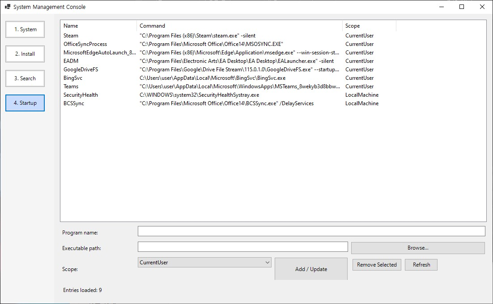

# System Management Console (`@sysadmin.ps1`)
> Windows를 최초로 설치 및 설정 하거나 하드웨어 사양을 채크해야 할 때, 오피스 프로그램 내에서 키워드를 검색이 필요할 때 사용할 수 있는 powershell script. 다수의 컴퓨터를 세팅해야 할 목적으로 작성한 스크립트임. 


## 1. 실행화면:




## 2. 작성 프롬프트:
아래의 이미지를 같은 폴더에서 제공하고 


codex를 아래와 같이 실행 후, 

```bash
codex -a on-failure --sandbox workspace-write
```

다음 프롬프트를 실행한다.  

```bash
"@plan.png의 파일을 참고하여 powershell 소스를 만들어줘"
```

## 3. 참고:
1. coding은 1줄도 안한 순수 Vibe coding 결과
2. 코드 실행을 위해 빌드 및 테스트 작업 만 진행
3. Google Apps Script는 설치정보를 갱신하기 위한 Lite 서버로 활용(없어도 무방함)
4. 코드 최적화 부분에서 준수한 결과(Powershell, Google Apps Script 모두) 
5. (4)의 내용과 반대이지만 가끔 디버깅 코드와 애매한 코드구조가 포함되어 있음(누군가의 소스를 참고해서 템플릿으로 만든 느낌임).

아래부터는 Vibe Coding으로 만든, 소스와 문서파일
---

Windows Forms 기반의 시스템 관리 도구로, 하드웨어 인벤토리, 문서/파일 검색, 부팅 프로그램 관리, 소프트웨어 설치 자동화를 하나의 UI에서 제공합니다. `Install` 탭은 Google Apps Script(GAS) 웹 앱과 연동해 설치 패키지를 원격으로 받아오고, 수행 결과를 다시 GAS에 기록.

## UI Overview
- `System` tab: CPU, 메인보드, GPU, 메모리, 디스크, 네트워크 어댑터 정보를 CIM/WMI를 통해 조회해 그리드로 표시.
- `Install` tab: GAS에서 내려받은 패키지 목록을 보여주고, 다운로드·설치·로그 전송을 자동화.
- `Search` tab: 일반 텍스트와 DOCX/XLSX/PDF 압축 구조를 직접 파싱해 키워드 하이라이트를 제공.
- `Startup` tab: HKCU/HKLM `Run` 레지스트리 엔트리를 열람·추가·삭제.

## Install Workflow Highlights
- `Populate-PackageList([switch]$ForceRefresh)`: `SYSADMIN_GAS_URL`이 지정돼 있으면 GAS `doGet?action=packages` 응답(JSON)을 읽어 패키지 목록출력. 호출 실패 시 `Get-DefaultInstallPackages`가 제공하는 내장 카탈로그로 자동 대체.
- `Reload Packages` button: `Populate-PackageList -ForceRefresh`를 호출해 최신 목록을 다시 가져오고 상태 패널에 결과출력.
- `Download & Install` button: 선택된 항목을 임시 경로에 내려받아 무인 설치 스위치를 포함해 실행합니다. 완료 또는 오류 메시지는 `Update-InstallStatus`에 기록.
- `Send-InstallReport(package, status, ...)`: 설치 성공/실패 로그를 `doPost?action=log`로 전송해 Google Sheets `InstallLog` 시트에 누적. 웹 앱이 응답하지 않으면 상태 패널에 경고를 표시 및 동작은 계속.

## Google Apps Script Backend
- 소스 코드 위치: `gas/Code.gs`
- `doGet?action=packages`: `Packages` 시트를 읽어 활성(`Enabled=TRUE`) 항목을 JSON 배열로 반환.
- `doPost?action=log`: PowerShell 클라이언트가 전송한 설치 결과를 `InstallLog` 시트에 append.
- Script property `PACKAGE_API_KEY`를 이용해 단순 API 키 인증을 지원.

## Deploying the GAS Web App
1. **Create the spreadsheet**
   - 새 Google 스프레드시트를 만들고 `Packages` 시트 1행에 `Name`, `Url`, `Description`, `Arguments`, `Version`, `Category`, `Enabled`를 입력.
   - (선택) `InstallLog` 시트를 추가하거나, 첫 로그 수신 시 스크립트가 자동으로 헤더를 작성.
2. **Load the script**
   - `Extensions > Apps Script`를 열고 기본 `Code.gs` 내용을 저장소의 `gas/Code.gs`로 교체.
3. **Configure API key (optional)**
   - Apps Script 콘솔에서 `Project Settings > Script Properties`에 `PACKAGE_API_KEY` 값을 추가. 키를 비워두면 인증 없이도 접근 가능.
4. **Deploy as Web App**
   - `Deploy > New deployment` → `Web app`
   - `Execute as`: *Me*, `Who has access`: *Anyone with the link*
   - 배포 후 표시되는 웹 앱 URL을 복사.
5. **Configure the PowerShell client**
   ```powershell
   # 세션 한정
   $env:SYSADMIN_GAS_URL = "https://script.google.com/macros/s/XXXX/exec"
   $env:SYSADMIN_GAS_KEY = "your-api-key"        # optional
   $env:SYSADMIN_GAS_TIMEOUT = "20"              # optional, seconds (default 15)

   # 영구 반영 (PowerShell 관리자 콘솔)
   setx SYSADMIN_GAS_URL "https://script.google.com/macros/s/XXXX/exec"
   setx SYSADMIN_GAS_KEY "your-api-key"
   ```
6. **Verify**
   - `sysadmin.ps1` 실행 후 Install 탭에서 `Reload Packages`를 눌러 목록이 GAS에서 내려오는지 확인합니다.
   - 아무 패키지나 테스트 설치 또는 모의 실행 후 `InstallLog` 시트에 로그가 쌓이는지 점검합니다.

## Environment Variables
- `SYSADMIN_GAS_URL` (required for remote sync): GAS 웹 앱 배포 URL (`.../exec`)
- `SYSADMIN_GAS_KEY` (optional): GAS `PACKAGE_API_KEY`와 일치하는 API 키 값
- `SYSADMIN_GAS_TIMEOUT` (optional): REST 호출 타임아웃(초), 기본 15

환경 변수가 설정되지 않았거나 GAS 호출에 실패하면 빌트인 패키지 목록(7-Zip, VS Code, Git for Windows)으로 자동 전환되며, 상태 패널에 해당 사실을 안내.

## Search & Startup Tabs (summary)
- `Invoke-FileSearch`는 텍스트/문서 포맷을 분기 처리하여 스니펫을 구성, 취소 플래그(`script:SearchCancelled`)로 UI 응답성을 유지.
- `Get-StartupEntries`, `Add-StartupEntry`, `Remove-StartupEntry`는 HKCU/HKLM의 `...CurrentVersion\Run` 키를 제어.

## Operational Notes
- Windows PowerShell 5.1 이상에서 동작하며, TLS 1.2를 활성화해 HTTPS 호출을 수행.
- GAS 호출 실패 시에도 설치 기능은 로컬 패키지 정보로 계속 진행되며, 실패 원인은 `Install` 탭 하단 로그에서 확인할 수 있음.
- 네트워크 차단 환경에서는 `SYSADMIN_GAS_URL`을 비워 두거나 제거하여 항상 로컬 카탈로그만 사용하도록 구성할 수 있음.
